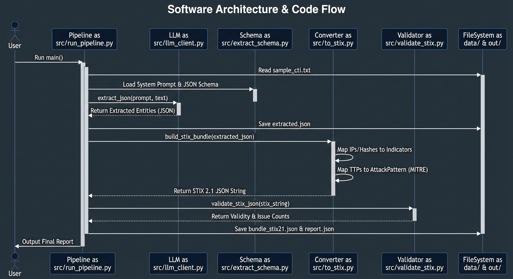

# Automated Threat Intelligence & Hybrid Defense System (Layer 1-5)


## 📖 Project Overview (專案簡介)

This project implements a **Next-Gen Automated CTI Defense System**. It leverages Large Language Models (LLMs) to transform unstructured Cyber Threat Intelligence (CTI) reports into structured STIX 2.1 objects and integrates with OpenSearch for a **Hybrid Detection Mechanism**.

The system is designed with a 5-Layer architecture:
* **Layer 1 & 2:** Automated CTI Extraction & STIX Conversion (LLM-based).
* **Layer 3:** Vector Database Storage (OpenSearch).
* **Layer 4:** Rule-Based Detection (Known Threats).
* **Layer 5:** Semantic Anomaly Detection (Unknown Threats via Vector Search).

## 🏗 System Architecture (系統架構)


*(This diagram visualizes the logic within `src/run_pipeline.py`)*

## ✨ Key Features

1.  **Unstructured to Structured**: Automatically parses natural language CTI reports (PDF/Txt) into validated STIX 2.1 JSON bundles using OpenAI/Azure GPT models.
2.  **Vector Database Integration**: Ingests system logs and calculates embeddings for semantic search using OpenSearch k-NN.
3.  **Hybrid Detection Engine**:
    * **Rule-Based**: Matches logs against CTI Indicators (IPs, Domains, Hashes).
    * **Semantic-Based**: Detects anomalies by calculating Cosine/L2 distance between new logs and historical baselines.
4.  **Automated Pipeline**: End-to-end flow from report ingestion to threat alert generation.

## 🚀 Getting Started

### Prerequisites
* Python 3.10+
* Docker Desktop (for OpenSearch)
* OpenAI API Key (or Azure OpenAI Key)

### Installation

1.  **Clone the repository**
    ```bash
    git clone [https://github.com/uuluul/CTI_Project_Layers.git](https://github.com/uuluul/CTI_Project_Layers.git)
    cd CTI_Project_Layers
    ```

2.  **Set up Virtual Environment**
    ```bash
    python -m venv .venv
    source .venv/bin/activate  # Mac/Linux
    # .venv\Scripts\activate   # Windows
    ```

3.  **Install Dependencies**
    ```bash
    pip install -r requirements.txt
    ```

4.  **Environment Configuration**
    Create a `.env` file based on `.env.example`:
    ```bash
    cp .env.example .env
    # Edit .env and input your API Keys
    ```

5.  **Start Database**
    ```bash
    docker-compose up -d
    ```

## 🏃‍♂️ Usage

### 1. Initialize OpenSearch Index (Layer 3)
Set up the vector index in OpenSearch.
```bash
python -m src.setup_opensearch
```
### 2. Ingest Baseline Logs
Simulate normal system behavior by ingesting logs into the vector database.
```bash
python -m src.ingest_logs
```
### 3. Run CTI Pipeline (Layer 1 & 2)
Convert a sample CTI report (data/sample_cti.txt) into STIX format.
```bash
python -m src.run_pipeline
```
### 4. Run Detection (Layer 4 & 5)
Check for known indicators (Rules) and unknown anomalies (AI).
```bash
# Rule-based detection
python -m src.detect_rules
# Semantic anomaly detection
python -m src.detect_anomaly
```

## 📂Project Structure (專案結構)
```Plaintext
├── data/               # Raw CTI samples and mock data
├── out/                # Generated STIX JSON bundles
├── src/
│   ├── run_pipeline.py    # Main CTI extraction logic
│   ├── detect_rules.py    # Layer 4: Exact match detection
│   ├── detect_anomaly.py  # Layer 5: Vector-based detection
│   ├── ingest_logs.py     # Log ingestion & embedding
│   └── to_stix.py         # STIX 2.1 object builder
├── docker-compose.yml  # OpenSearch & Dashboards setup
└── requirements.txt    # Python dependencies
